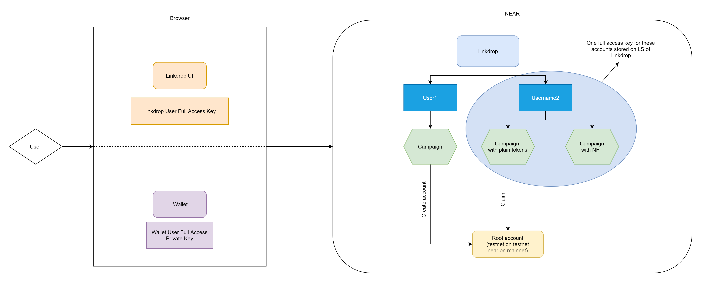

# Near Linkdrop
Linkdrop is an application that allows you to send NEAR to other people via a link or
helps a new user to create the account - you can pay a gas fee instead of a user
and send NEAR to this account.

## Architecture

NEAR Linkdrop - is a set of a few contracts.
We have 3 different types of contracts - Linkdrop, User and Campaign. Each contract is deployed to its
own account. We use name hierarchy here - every user account will be a subaccount of `linkdrop.testnet`
(e.g `bob.linkdrop.testnet`), and each campaign account will be a subaccount of the user account
(e.g `my-first-campaign.bob.linkdrop.testnet`).

Linkdrop - it's a root contract of the app and the entry point for a new users. This contract 
creates a new user account and deploys a user contract code to it.

User - this is a contract that allows a user to create new campaigns. This account is bounded with the
user Wallet account, which means if the Wallet account id is `bob.testnet` his Linkdrop account id
will be `bob.linkdrop.testnet`

Campaign - it's a contract that an end user will interact with (using a link). Right now we have
only one type of the campaign - NEAR campaign, but it will possible to add new campaigns type such as 
NFT, NFT-FT, NFT-NEAR etc.

## NEAR campaign
Near campaign - the type of campaign, that allows you to create the set of links. Each link will be unique and will
contain some amount of NEAR, which is the same for all links of the campaign. There are two ways how end-user can use 
this link - create a new account or get NEAR on his existing account.
For both of these actions we use the 'root account' - `testnet` in the testnet network and `near` in the mainnet.

### How to create a new campaign
* Create a new user - call `create_user_account` on `linkdrop.testnet`
* Create a new NEAR campaign account and send some amount of NEAR - call `create_near_campaign` 
   of the user contract.
* After the campaign is created add keys into the state - call `add_keys` of the campaign contract.
   You can generate keys from the single mnemonic phrase - on the UI we generate from it a full-access key for
   user account, for all campaigns and for all keys of these campaigns.
* Your campaign is ready to use. 

### How to use a campaign
* You can check campaign statistic - call `get_campaign_metadata`,
* Check a status of each key (it's active or it was used) - call `get_keys`
* Deactivate a key if you want to get your NEAR back (or if you sent a link to the wrong person) - call `refund_keys`

